# PersonaCraft: Technical Summary and System Specification

> **A data-driven LLM-powered system for automated persona generation from survey data**

---

## Introduction

PersonaCraft is a data-driven system that leverages Large Language Models (LLMs) to generate humanized representations of user segments from survey data. Its primary objective is to bridge traditional persona development methodologies with the capabilities of Generative AI, addressing a significant research gap in the field.

While prior systems have applied AI to assist in persona creation, the task of automatically generating complete, data-grounded persona profiles with rich narrative detail has remained largely unresolved. PersonaCraft introduces a comprehensive, multi-stage methodology designed to overcome this challenge by integrating LLMs into specific, targeted tasks that augment a robust, data-driven foundation.

---

## 1. Paper Overview and System Rationale

### 1.1 Background

Personas are a cornerstone of user-centered design (UCD), providing critical insights into the behaviors, motivations, and needs of target users. However, traditional persona creation is a time-consuming and costly process that lacks scalability.

Early attempts at automatic persona generation, while promising, struggled to overcome a persistent **"breadth-depth trade-off"**—they could process vast amounts of quantitative data but often produced information-poor profiles that required significant manual intervention to add the necessary narrative and interpretive depth.

### 1.2 Research Goal and Problem Statement

> [!IMPORTANT]
> **Core Research Goal:** Develop and validate a comprehensive methodology that leverages LLMs to automate the generation of complete, actionable, and data-grounded personas from survey data.

The system directly addresses the unresolved problem of creating rich persona profiles that are both scalable and qualitatively insightful, thereby reducing the reliance on manual human effort for interpretative and narrative tasks.

### 1.3 Motivation: Limitations of Traditional Methods

| Method | Key Limitations |
|--------|-----------------|
| **Traditional / Manual Persona Creation** | • Time-Consuming: Requires significant manual effort for data analysis (e.g., ethnographic studies, interviews) and synthesis. • Lacks Scalability: Difficult to apply to large datasets or rapidly changing user populations. • High Cost: Incurs substantial expenses in terms of time, effort, and money. |
| **Early Automated Persona Generation** | • Requires Human Supervision: Still relies on manual decision-making for tasks like hyperparameter tuning, labeling clusters, writing narratives, and selecting images. • Information-Poor Outcomes: Often produces "latent patterns" that represent behavioral tendencies but lack the interpretive depth to explain who the users are behind the data. • Breadth-Depth Trade-Off: Capable of processing large volumes of data (breadth) but struggles to generate interpretive depth without significant human intervention. |

### 1.4 High-Level System Description

PersonaCraft is a robust, multi-stage methodology designed to convert raw survey data into actionable, user-centric personas. The system employs a structured pipeline that integrates:

- **Traditional Machine Learning** → For user segmentation
- **Targeted LLM-driven Tasks** → For data enrichment

This hybrid approach ensures that the core persona segments are rigorously grounded in statistical patterns within the user data, while the narrative and interpretive layers—such as headlines, descriptions, and data interpretations—are intelligently generated by LLMs to create a complete and compelling profile.

---

## 2. Data Foundations

> [!NOTE]
> The validity and credibility of the generated personas are directly dependent on their grounding in real user data.

The system is designed to operate on survey data, which the source paper identifies as the most frequently used data type for persona creation. This focus ensures broad applicability across domains where user feedback and population-level research are common.

### 2.1 Data Type and Source

| Attribute | Description |
|-----------|-------------|
| **Primary Data Type** | Survey data or any dataset with a similar tabular structure (respondents and their answers) |
| **Demonstration Dataset** | "American Trends Panel Wave 99: Artificial Intelligence (AI) and Human Enhancement" dataset from the Pew Research Center (10,260 US adults) |

### 2.2 Supported Question Formats

PersonaCraft handles a wide array of common survey question types:

- ✅ Demographic Questions
- ✅ Likert Scale Questions
- ✅ Open-Ended Questions
- ✅ Multiple-Choice Questions
- ✅ Matrix Questions
- ✅ Rating Scales
- ✅ Closed-Ended Questions

### 2.3 Data Structure and Preparation

#### Required Data Structure

The input dataset must be structured with:
- Each **survey question** as a distinct **column**
- Each **respondent** as a separate **row**
- **Cells** represent a specific respondent's answer to a given question

#### Data Preparation Steps

Before processing, the data must be cleaned according to specific guidelines:

1. Remove question ID prefixes from question text
2. Exclude irrelevant columns that do not contribute to the persona profile:
   - Unique respondent IDs
   - Interview timestamps
   - Conditional open-ended questions that apply only to a small subset of users

> [!WARNING]
> This rigorous data preparation is a non-negotiable prerequisite, ensuring the integrity of all subsequent automated analysis and generation stages.

---

## 3. System Architecture and Methodology

The PersonaCraft architecture is a systematic, four-stage pipeline designed to transform raw survey data into enriched, data-driven personas.

### Stage 1: Preparing the Dataset

**Objective:** Standardize dataset formats across different platforms.

The goal is to create a consistent input structure that streamlines the subsequent data preparation and analysis processes, ensuring compatibility with the system's automated workflows.

### Stage 2: Mapping Question Types

**Objective:** Map each type of survey question to a specific data transformation approach.

| Question Type | Transformation Approach | LLM Task |
|--------------|-------------------------|----------|
| **Demographic Questions** | Map numerical age data into predefined age ranges (e.g., 18-24, 25-34) | — |
| **Likert Scale Questions** | Assign numerical values to responses | TASK 1 |
| **Open-Ended Questions** | Identify potential topics or themes within responses | TASK 2 |
| **Multiple-Choice Questions** | One-hot encoding (separate columns for each option) | — |

### Stage 3: Data Pre-processing

**Objective:** Transform the dataset based on mapped values and apply LLM-driven analysis.

| Task | Description |
|------|-------------|
| **Question Classification (TASK 3)** | Categorizes survey questions into logical groups (e.g., "Technology Acceptance," "Internet and Social Media") |
| **Question Summarization (TASK 4)** | Condenses long and complex survey questions into short, keyword-based headings |

### Stage 4: Persona Generation

**Objective:** Synthesize all processed data to construct and enrich the persona profiles.

#### 4.1 Clustering Methods

PersonaCraft offers four clustering methods based on the survey's data types:

| Method | Best For |
|--------|----------|
| Survey Items-Based Grouping | General use |
| K-Modes Clustering | Categorical data |
| K-Prototypes Clustering | Mixed numerical and categorical data |
| Hierarchical (Agglomerative) Clustering | Numerical data |

#### 4.2 Statistical Analysis

The **Kruskal–Wallis test** (non-parametric) is applied to identify survey questions that most significantly differentiate the generated personas. Results determine the priority order of information in the final profile.

#### 4.3 Persona Computation

The system computes answer frequencies for each survey question within each persona cluster. This quantitative data forms a data-driven **"skeleton persona profile"**.

#### 4.4 Enrichment

The skeleton profile is transformed into a vivid persona through:

- 🖼️ Demographically appropriate names and images
- 📝 LLM-generated headlines and descriptions (TASK 6)
- 📊 Visualized survey response data with charts
- 💬 Narrative data interpretations (TASK 5)

---

## 4. LLM Integration and Tasks

> [!TIP]
> **Core Innovation:** LLMs are deployed for specific, targeted tasks—not for foundational user segmentation. This grounds personas in hard data while leveraging LLM narrative capabilities.

### 4.1 LLM Models and Configuration

| Configuration | Value |
|---------------|-------|
| **Models Utilized** | OpenAI's GPT-4 and GPT-3.5-turbo |
| **Platform** | Microsoft Azure |
| **Version** | 2023-03-15-preview |
| **Temperature** | 0.7 (balancing creativity and consistency) |

#### Dual-Model Approach

| Model | Used For |
|-------|----------|
| **GPT-4** | Complex tasks: Question classification (TASK 3), Question summarization (TASK 4) |
| **GPT-3.5-turbo** | Other tasks |

### 4.2 LLM Task Breakdown

| Task ID | Objective | Input | Output |
|---------|-----------|-------|--------|
| **TASK 1** | Assign numerical values to Likert scale responses | Survey question + unique responses | JSON object with responses mapped to sequential numerical values |
| **TASK 2** | Identify potential topics/themes in open-ended responses | An open-ended survey question | JSON list of potential broad themes |
| **TASK 3** | Categorize survey questions into logical groups | A list of survey questions | JSON object grouping questions under title and description |
| **TASK 4** | Condense long survey questions into concise headings | A list of survey questions | JSON object mapping questions to keyword-based headings |
| **TASK 5** | Generate narrative interpretations of response data | Survey question, responses, and distribution percentages | Short descriptive text interpreting the data |
| **TASK 6** | Create persona headline and overall description | Key survey questions and corresponding answer counts | Keyword-based headline and multi-sentence summary |

### 4.3 Prompting Strategy

The specific prompts used for each of the six tasks are detailed in **Appendix A** of the source paper. The authors employed an iterative approach to prompt design, refining the instructions to obtain accurate and desired results.

---

## 5. Persona Representation

The final output is a comprehensive persona profile that integrates **quantitative, data-driven evidence** with **qualitative, narrative elements**.

### 5.1 Persona Structure and Components

| Component | Description |
|-----------|-------------|
| **Name and Image** | Demographically appropriate name and corresponding stock photo |
| **Key Demographics** | Highlighted top demographic attributes (e.g., female, 30-49, White Non-Hispanic) |
| **LLM-generated Headline** | Concise headline summarizing key traits |
| **LLM-generated Description** | Detailed paragraph about persona's traits and attitudes |
| **Grouped Survey Data** | Organized under logical, LLM-generated group headings |
| **Response Visualizations** | Bar charts showing percentage distribution of answers |
| **LLM-generated Headings** | Short, intuitive headings for each visualized question |
| **Interpretation Text** | Narrative text providing context for visualized data |

### 5.2 Output Format

PersonaCraft produces a **hybrid output** combining:

- **Narrative components:** Headlines, descriptions, interpretations (qualitative story)
- **Structured components:** Demographics, response distributions, charts (quantitative evidence)

> [!NOTE]
> **Persona Lifecycle:** The system is presented as a method for generating static personas from a given dataset. Lifecycle or update logic is not specified in the paper.

---

## 6. System Evaluation and Results

A multi-faceted evaluation was conducted combining:
- Internal technical checks of each LLM task
- Feedback from a general layperson audience
- Formal review by UX experts

### 6.1 Internal Evaluation of LLM Tasks

| Task | Metric | Score | Notes |
|------|--------|-------|-------|
| **TASK 1** | Correctness Rate | 67.5% | Functional but imperfect; occasional errors (duplicated numbers, wrong ordinal direction) |
| **TASK 2** | MOS | 4.71 (SD=0.48) | ✅ High standard; effective at identifying relevant themes |
| **TASK 3** | MOS | 3.55 (SD=0.69) | ⚠️ Lowest performer; lack of thematic coherence |
| **TASK 4** | MOS | 4.62 (SD=0.99) | ✅ Highly effective at creating concise headings |
| **TASK 5** | MOS | 4.47 (SD=0.90) | ✅ Robust narrative interpretation capability |
| **TASK 6** | Adversarial Accuracy | 93.3% | ✅ High degree of fitness to source data |

> Inter-rater reliability for TASK 1: Almost perfect (Fleiss' Kappa, κ = 0.843)

### 6.2 External Evaluation: Layperson Study (n=127)

Compared LLM-enhanced personas against non-LLM personas (raw data only) based on five criteria:

| Criteria | Result |
|----------|--------|
| Consistency | ✅ Significantly higher |
| Clarity | ✅ Significantly higher |
| Completeness | ✅ Significantly higher |
| Credibility | ✅ Significantly higher |
| Fluency | ✅ Significantly higher |

### 6.3 External Evaluation: UX Expert Study (n=21)

| Criteria | Result |
|----------|--------|
| Clarity | ✅ Significantly higher |
| Completeness | ✅ Significantly higher |
| Fluency | ✅ Significantly higher |
| Consistency | — Null hypothesis could not be rejected* |
| Credibility | — Null hypothesis could not be rejected* |

*Attributed to insufficient statistical power given sample size (n=21)

---

## 7. Assumptions, Limitations, and Future Work

### 7.1 Stated Assumptions and Constraints

| Type | Description |
|------|-------------|
| **Core Assumption** | Input data is in a structured survey format (questions in columns, respondents in rows) |
| **Token Limits** | Amount of data processable in a single prompt is limited |
| **Financial Cost** | Commercial LLM APIs incur costs; factor in large-scale applications |

### 7.2 Explicitly Discussed Limitations

1. **Single Dataset Demonstration** — Further testing needed for robustness across diverse datasets
2. **Partial Automation** — Nuanced tasks like identifying most important questions remain challenging
3. **LLM Bias Risk** — Mitigated because tasks are heavily grounded in provided user data
4. **Prompt Engineering Risks** — Replicability across LLM versions, token limits, model dependencies
5. **Hallucination** — Not observed as a concern for the specific, data-grounded tasks

### 7.3 Suggested Future Work

| Direction | Description |
|-----------|-------------|
| **Diverse Applications** | Test with wider variety of datasets and use cases |
| **Automation of Key Insights** | Develop automated methods for extracting critical survey questions |
| **Minority Representation** | Mitigate "averaging" problem in clustering for edge-case users |
| **Task Refinement** | Improve prompts and add validation for TASK 1 and TASK 3 |
| **Adaptation to Data Types** | Explore adaptation for qualitative interviews or mixed-method data |
| **Human-in-the-Loop Models** | Investigate collaborative workflows between experts and LLMs |
| **Dynamic Personas** | Develop personas that evolve in real-time with new data |

---

## Quick Reference

### System Pipeline Summary

```mermaid
flowchart TB
    subgraph Input
        A["📊 Survey Data<br/>(Tabular Format)"]
    end
    
    subgraph "PersonaCraft Pipeline"
        B["Stage 1: Dataset Preparation"]
        C["Stage 2: Question Type Mapping<br/>(TASK 1, TASK 2)"]
        D["Stage 3: Data Pre-processing<br/>(TASK 3, TASK 4)"]
        E["Stage 4: Persona Generation<br/>(TASK 5, TASK 6)"]
    end
    
    subgraph Output
        F["🎭 Complete Persona Profiles<br/>(Narrative + Data)"]
    end
    
    A --> B --> C --> D --> E --> F
    
    style A fill:#e8f4fd,stroke:#4a90d9
    style F fill:#f3e8fd,stroke:#9370db
```

### Key Metrics at a Glance

| Metric | Value |
|--------|-------|
| Demo Dataset Size | 10,260 respondents |
| LLM Tasks | 6 |
| Clustering Methods | 4 |
| Layperson Study Size | n=127 |
| UX Expert Study Size | n=21 |
| Best Task Performance (MOS) | 4.71 (TASK 2) |
| Weakest Task Performance (MOS) | 3.55 (TASK 3) |

---

*This document serves as a technical foundation for understanding and potential future implementation of the PersonaCraft system.*
